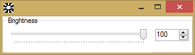

# Dimmer
Reduces PC brightness by creating a semi-transparent black overlay over the screen.

 
  

## Download
<a href="https://github.com/ciucacosmin109/Dimmer/raw/master/x86/Release/Dimmer.exe">x86 (32 bit)</a>

<a href="https://github.com/ciucacosmin109/Dimmer/raw/master/x64/Release/Dimmer.exe">x64 (64 bit)</a>

## License
[GPL v3](./LICENSE)
